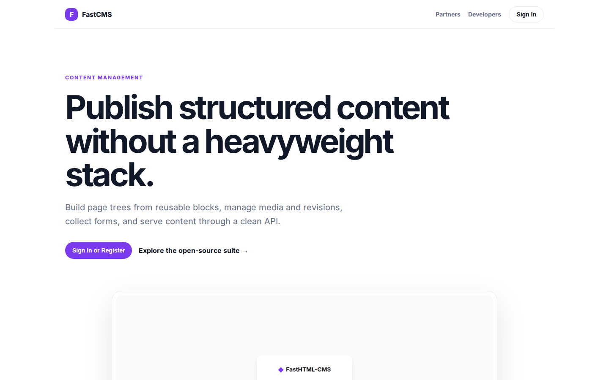
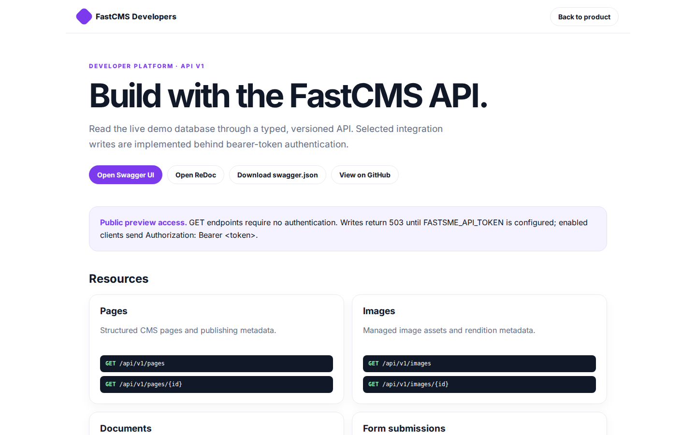

# FastCMS Platform Guide

**Published:** 2026-08-19
**Platform:** [https://cms.fastsme.com](https://cms.fastsme.com)
**Source:** [github.com/predictivelabsai/FastCMS](https://github.com/predictivelabsai/FastCMS)

## Platform overview

A modern, lightweight content management system built with and SQLite. Inspired by , reimagined for simplicity and speed.

This visual guide was reviewed against the live product using Playwright. Screens and available navigation can vary by account, role, and deployment configuration.

## 1. Publish structured content without a heavyweight stack.

CONTENT MANAGEMENT Publish structured content without a heavyweight stack. Build page trees from reusable blocks, manage media and revisions, collect forms, and serve content through a clean API. Sign In or Register Explore the open-source suite → Product tour

Screen reviewed at: [https://cms.fastsme.com/](https://cms.fastsme.com/)

## 2. Build with the FastCMS API.

FastCMS Developers Back to product DEVELOPER PLATFORM · API V1 Build with the FastCMS API. Read the live demo database through a typed, versioned API. Selected integration writes are implemented behind bearer-token authentication. Open Swagger UI Open ReDoc Do

Screen reviewed at: [https://cms.fastsme.com/developers](https://cms.fastsme.com/developers)

## 3. Sign in

Sign in with Google Sign in to continue to fastsme.com Email or phone Forgot email? Next Create account Afrikaans azərbaycan bosanski català Čeština Cymraeg Dansk Deutsch eesti English (United Kingdom) English (United States) Español (España) Español (Latinoam

Screen reviewed at: [https://accounts.google.com/v3/signin/identifier?opparams=%253F&dsh=S1413076949%3A1787122582397586&access_type=online&client_id=887059023987-2a7spj1m82eivobdbt1itb3cqca6tpt1.apps.googleusercontent.com&o2v=2&prompt=select_account&redirect_uri=https%3A%2F%2Fcms.fastsme.com%2Fauth%2Fgoogle%2Fcallback&response_type=code&scope=openid+email+profile&service=lso&state=fYfBKNo8eXPkf8DgHL6UySPei3Z5QYVNrSDF5RzTAQg&flowName=GeneralOAuthLite&continue=https%3A%2F%2Faccounts.google.com%2Fsignin%2Foauth%2Flegacy%2Fconsent%3Fauthuser%3Dunknown%26part%3DAJi8hAMAw_icrPGJ2PQ-z2lclOUz7U3BJ9yS58xcerjmHI6UpgEFv19d9RNp0r3a1vaIrldoejMX0a_X9TDtvZZOnwbgYNSECbTF8106rcJSAGWMDmNdZq_dDeo_6L_HZ8hY8AnxCjLd-hMjxbWklLfAl5b8ncb1bioXW2-jgK2nICqiE59rDNftxjGG9e9bG3l5GUyBy6W0qigiDpqN9UU4EwG5QQrkH_2zJRRYHp1eyf6ja3omAjdVTO8qhn-Z5E5ex_9mzTgoEtSgdOARMBq286ppt5sgAEtj4jux-4B1IgF-u20dPaNmw0JLKOyeS_VaupgI2c8nLpm4koDgI4CW7trWO9c_RB4ZulDfGe3ZqAw9RYsB3CAixqNgN-sWFy_i0Kh847qZt_G_QwyxHS-wI7ej2QEOh-qlo5z7NmM6Ei0_GimZcLro20fbx35XRzSULaui5E7szWpWQAUtJO1IVnkG0AGQNw%26flowName%3DGeneralOAuthFlow%26as%3DS1413076949%253A1787122582397586%26client_id%3D887059023987-2a7spj1m82eivobdbt1itb3cqca6tpt1.apps.googleusercontent.com%23&app_domain=https%3A%2F%2Fcms.fastsme.com&rart=ANgoxcdCjiXwN5EXcyVL47g-eOfYvAysnOAR8CvEBd4hY8Q0-mqafi-nbmiN7JIvdNnXUSJM2u5ZMb4w5KwtZc14chU3MGop0Seahj0Ha_0HhHeb_Eo6-hQ](https://accounts.google.com/v3/signin/identifier?opparams=%253F&dsh=S1413076949%3A1787122582397586&access_type=online&client_id=887059023987-2a7spj1m82eivobdbt1itb3cqca6tpt1.apps.googleusercontent.com&o2v=2&prompt=select_account&redirect_uri=https%3A%2F%2Fcms.fastsme.com%2Fauth%2Fgoogle%2Fcallback&response_type=code&scope=openid+email+profile&service=lso&state=fYfBKNo8eXPkf8DgHL6UySPei3Z5QYVNrSDF5RzTAQg&flowName=GeneralOAuthLite&continue=https%3A%2F%2Faccounts.google.com%2Fsignin%2Foauth%2Flegacy%2Fconsent%3Fauthuser%3Dunknown%26part%3DAJi8hAMAw_icrPGJ2PQ-z2lclOUz7U3BJ9yS58xcerjmHI6UpgEFv19d9RNp0r3a1vaIrldoejMX0a_X9TDtvZZOnwbgYNSECbTF8106rcJSAGWMDmNdZq_dDeo_6L_HZ8hY8AnxCjLd-hMjxbWklLfAl5b8ncb1bioXW2-jgK2nICqiE59rDNftxjGG9e9bG3l5GUyBy6W0qigiDpqN9UU4EwG5QQrkH_2zJRRYHp1eyf6ja3omAjdVTO8qhn-Z5E5ex_9mzTgoEtSgdOARMBq286ppt5sgAEtj4jux-4B1IgF-u20dPaNmw0JLKOyeS_VaupgI2c8nLpm4koDgI4CW7trWO9c_RB4ZulDfGe3ZqAw9RYsB3CAixqNgN-sWFy_i0Kh847qZt_G_QwyxHS-wI7ej2QEOh-qlo5z7NmM6Ei0_GimZcLro20fbx35XRzSULaui5E7szWpWQAUtJO1IVnkG0AGQNw%26flowName%3DGeneralOAuthFlow%26as%3DS1413076949%253A1787122582397586%26client_id%3D887059023987-2a7spj1m82eivobdbt1itb3cqca6tpt1.apps.googleusercontent.com%23&app_domain=https%3A%2F%2Fcms.fastsme.com&rart=ANgoxcdCjiXwN5EXcyVL47g-eOfYvAysnOAR8CvEBd4hY8Q0-mqafi-nbmiN7JIvdNnXUSJM2u5ZMb4w5KwtZc14chU3MGop0Seahj0Ha_0HhHeb_Eo6-hQ)

## Getting started

Visit [https://cms.fastsme.com](https://cms.fastsme.com) to explore FastCMS. For source code and deployment details, use the GitHub link above.
